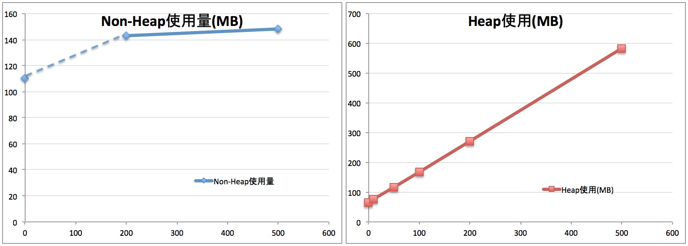
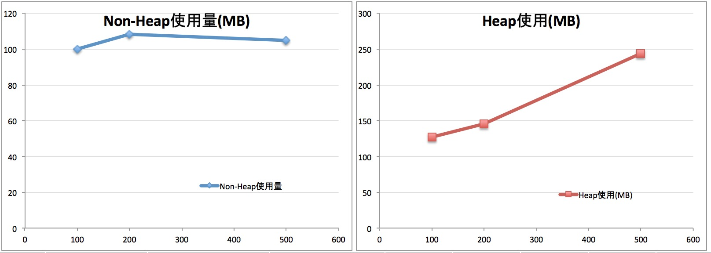
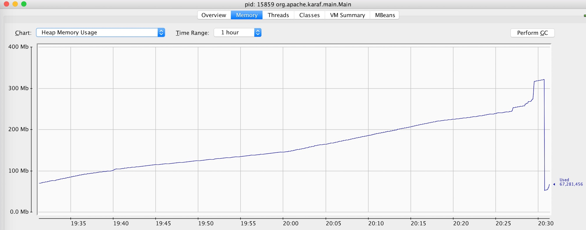

:source-highlighter: pygments
:toc:
:sectnums:
:icons: font


= Camelのメモリ使用傾向

今回は、Camelのメモリ使用量を実測し、メモリ使用量の傾向と変動要素との関係を解説します。
最後に、幾つかのQ&Aを通じて、開発時のメモリ関連のベストプラクティスを紹介します。


== 初めに

今回の内容は、簡単なサンプルをベースに実測を行っております。
実際に開発物がもっと複雑になると思います。
その為、本書で記載された実測値が実開発プロジェクトの結果と異なリます。

Camelで開発したCamelルートのメモリ使用量は、
大きく、固有的な使用、データ処理に使用の2つに分別できます。

1. 固有的に使用するメモリは、CamelContext数( <<CamelContextのメモリ使用量>>) 、Camelルート数( <<Camelルートのメモリ使用量>> )と関係あります。それ以外に、コンテナによって消費される部分もありますが、今回はApache Karafの一例 <<Karafのメモリ使用量>> を掲載させてください。

2. データ処理に使用するメモリは、処理の複雑度、データサイズ、実行並列度に大きく依存しますので、実プロジェクトの開発内容に合わせて測定してください。今回はご参考の為、一例 <<DB複製の連携処理>> を掲載させてください。


== 固有的に使用するメモリ


=== CamelContextのメモリ使用量

CamelContextは、Camelルート、プロセッサ、エンドポイントなどの連携処理に関係するコンポーネントの実行環境です。
CamelContextは、連携処理に必要な共通機能を提供するため、Heap領域を消費します。また、初期設定でJMXが有効化されて、CamelContextに含まれるコンポーネント毎にMBeanがメモリ上に作成されます。

結果を先に言うと、
************************************************
CamelContextのヒープ使用量 = CamelContext数 x 1MB +
※ これは複雑度(低)のCamelルートのみ。複数度に比例に使用量が増加しますので、実際の連携実装時に再確認が必要です。
************************************************

以下は、同一複雑度(低)のCamelContextを複数デプロイして、メモリ消費量の検証結果を説明します。

検証用CamelContextは、

1. 1つCamelContextにつき1つCamelルート
2. REST DSL利用したREST API実装、HTTP GETで受けてechoする

.CamelContextの実装例
```xml
<camelContext id="rest1" xmlns="...">
    <restConfiguration component="jetty" host="0.0.0.0" port="9001">
        <componentProperty key="enableJmx" value="true"/>
    </restConfiguration>
    <rest path="/rest1">
        <get uri="/{customerId}">
            <to uri="direct:getCustomer"/>
        </get>
    </rest>
    <route id="_route1" routePolicyRef="throttlePolicy">
        <from id="_from1" uri="direct:getCustomer"/>
        <throttle id="_throttle1" timePeriodMillis="5000">
            <constant>1000</constant>
            <log id="_log2" message="*** Id=${header.customerId}"/>
            <setBody id="_setBody2">
                <simple>${header.customerId}</simple>
            </setBody>
            <delay id="_delay1">
                <constant>100</constant>
            </delay>
        </throttle>
    </route>
</camelContext>
```

同じようなCamelContextを大量に複製(IDを入替え)してデプロイ後(Apache Karafへ)のヒープを測定した結果は以下に示します。

.CamelContext数とヒープ使用量
[format="csv",width="85%",cols="^3,>4,>4,>4", options="header"]
|======
Test No , CamelContext数, Non-Heap使用量 , Heap使用量
1       ,   0           , 110MB         ,  65MB
2       ,  10           , (*)           ,  75MB
3       ,  50           , (*)           , 116MB
4       , 100           , (*)           , 169MB
5       , 200           , 143MB         , 272MB
6       , 500           , 148MB         , 584MB
|======
※　一部値が未測定

-- CamelContext数:: コンテナ上にデプロイされるCamelContextの数(=Camelルート数)
-- ヒープ使用量:: 手動でGC実行直後のヒープ使用量

.CamelContext数とヒープ使用量


この実測値から、

- Non-Heap使用量がCamelContext数と比例に小幅に増加(気にするほどではない)
- Heap使用量がCamelContext数と比例に大幅な増加、凡そ１MB/CamelContext


=== Camelルートのメモリ使用量

Camelルートはプロセッサ、エンドポイントなどの部品の組み合わせを定義し、連携処理の定義です。

CamelルートはCamelContextと類似で、共通的な機能を提供しながら、デフォルトでJMXが有効化されています。
その為、Camelルートの複雑度がHeap使用量を左右します。

結果を先に言うと、
************************************************
Camelルートのヒープ使用量 = Camelルート数 x 0.3MB +
※ これは複雑度(低)のCamelルートのみ。複数度に比例に使用量が増加しますので、実際の連携実装時に再確認が必要です。
************************************************

以下は、同じ複雑度(低)のCamelルートを1つCamelContextに纏めて、デプロイ後(Apache Karafへ)のメモリ消費量の検証結果を説明します。

検証用Camelルートは、

1. 1つCamelContextのみ
2. 1つのCamelContextには、URI Template別のCamelルート、繰り返して構成され
3. 前と同様、REST DSL利用したREST API実装、HTTP GETで受けてechoする

.Camelルートの実装例
```xml
<camelContext ... >
  <...>
  <rest path="/rest500">
    <get uri="/1/{customerId}">
       <to uri="direct:getCustomer1"/>
    </get>
    <get uri="/2/{customerId}">
       <to uri="direct:getCustomer2"/>
    </get>
    <get> ... 繰り返す ...</get>
  </rest>
  <route id="route-rest1" routePolicyRef="throttlePolicy">
      <from  uri="direct:getCustomer1"/>
      < ... CamelContextの実装例と同様 ... >
  </route>
  <route id="route-rest2" routePolicyRef="throttlePolicy">
      <from  uri="direct:getCustomer2"/>
      < ... CamelContextの実装例と同様 ... >
  </route>
  <route> ... 繰り返す ... </route>
</camelContext ... >
```

.Camelルート数とヒープ使用量
[format="csv",width="85%",cols="^3,>4,>4,>4", options="header"]
|======
Test No , Camelルート数, Non-Heap使用量 , Heap使用量
1       , 100           , 100MB         , 127MB
2       , 200           , 108MB         , 146MB
3       , 500           , 105MB         , 244MB
|======

.Camelルート数とヒープ使用量


この結果から分かったことは、

- Non-Heap使用量がCamelルート数と比例に小幅に増加
- Heap使用量がCamelルート数と比例に増加、凡そ0.3MB/Camelルート

=== Karafのメモリ使用量

Karafがコンテナとして、実装パッケージのライフサイクル管理、ロギングなどの共通機能を提供します。Camelが実行されてなくてもメモリを消費します。

Karafが消費するNon-Heap領域は、一般的に60MB(初期状態) 〜 256MBになります。しかし、大量なクラスをロードする場合は、実機で確認してください。

Karafが消費するHeap領域は、連携実装の規模にほぼ依存しない、100MBと見ておけば良いでしょう。

結果を先に言うと、
************************************************
Karafのヒープ使用量 = 100MB
************************************************

以下は実機の測定結果を説明します。

[.bordered]


MaxHeapが2GBに設定の場合、60MBからスタートします。
1時間後に110MBに到達して、GCによって60MBに戻ったことが分かります。

また、下記のFeatureをインストールすると、60MB -> 65MBに小幅に増加します。

  - camel-cxf
  - camel-jetty
  - camel-dozer
  - camel-jackson

[WARNING]
上記の以外に、運用監視ツールの利用するメモリもあります。
例えば、JMXベースの管理ツールを使う場合、その間、タイムリーにコンテナの情報収集することで、コンテナが余分のメモリが消費されます。


== データ処理に使用するメモリ

連携処理時のヒープ使用量は基本的に動的なものとなります。
特に、処理内容の複雑度、データサイズ、実行並列度に大きく依存しますので、
以下はDB複製の連携処理の例を使って紹介します。


=== DB複製の連携処理

-- 対象の処理内容:: DB複製の連携処理、ソースDBからレコードを全件SELECTし、1件ずつターゲットDBへUPDATE/INSERTします。データ変換は単純な項目コピーです。
-- データサイズ:: 1レコードあたり1KB、項目数50個です。
-- 処理多重度:: 下記のテストケース毎に設定されます。

.並列処理時のメモリ使用量傾向
[format="csv",width="85%",cols=">2,>3,>5", options="header"]
|======
Test No , 並列度 , JVM全体のメモリ使用量
1       ,   200 , 1.5GB
2       ,   400 , 2.2GB
3       ,   600 , 3.3GB
|======

上記の検証結果では、200並列で凡そ1.1GBのメモリ消費することが分かります。これを計算すると、1並列あたり凡そ5.5MBのメモリを消費するの計算結果となります。

************************************************
連携処理のヒープ使用量 = 並列度 x 5.5MB +
※ これは一例です。処理内容の複雑度、データサイズ、実行並列度に大きく依存しますので、実機で検証が必要です。
************************************************


== Q&A


=== 1つのCamel-Contextで定義するCamel-Route数
*回答:*

Camelの仕様上、1つのCamel-Contextで定義するCamel-Route数の上限はありません。

過去の経験上、1つのCamelContextには、Camelルート100以下であります。

例えば、REST APIのBase Pathが1つのCamelContextで構成し、
配下のURI Template別にCamelルートで実装する例があります。

.REST DSLでCamel-ContextとCamel-Routeの定義例
[format="csv",width="90%",cols="1,3,3,2,4,4,4", options="header"]
|======
No., Base Path , URI Template  , Verb ,	Consumes , CamelContext, Route
1,   /say      , /hello        , GET  , all      , cxt1        , route1
2,   /say      , /bye          , GET  , all      , ctx1        , route2
3,   /say      , /bye          , POST , json     , ctx1        , route3
4,   /blog     , /hello        , POST , json     , ctx2        , route1
|======

また、前述の <<Camelルートのメモリ使用量>> と <<CamelContextのメモリ使用量>> を比較すれば分かりますが、より多くのCamelルートを1つのCamelContextに纏めることで、全体のメモリ消費を抑止できます。
例えば、500ルートを500のCamelContextで実装してデプロイの場合、584MBが消費されるに対し、500ルートを1つのCamelContextにした場合、244MBになります。

*その為、Camel-Contextで定義するCamel-Routeは、運用の容易さを考慮の上、数を100以下に抑えながら、1つのCamel-Contextに集約したほうが良いです。*


=== 1つのCamel-Routeに含められるコンポーネント数・エンドポイント数
*回答:* 

Camelの仕様上、このような上限はありません。

過去の経験上、1つのCamelルートに、プロセッサ100以下、エンドポイント10以下が殆どでした。

この数を超えた複雑な処理も実装が可能ですが、以下の理由から複数のCamelルートに分割することを推奨します。

1. ロジックの *可視性* , *再利用性* が低く、保守コスト増
2. エラーハンドリングの *複雑度* が増し、開発コスト増
3. 障害時の *問題切り分け* が難しく、運用コスト増だけでなく、ビジネス上の影響でるおそれがある


=== 現実的なヒープサイズ

例えば、これくらい大きくなったらプロセス分割を薦める、等の知見が知りたいです。

*回答:* 

まずは、一般的に、連携処理は業務アプリケーションと同様に、処理特性から *オンライン* と *バッチ* に分けて、それぞれ専用のコンテナインスタンス(プロセス)で分割するべきです。

理由は、オンライン連携はデータサイズが小さく、並列度が高く、レスポンスタイムが要求されます。
一方で、バッチ連携がサイズ大きく、有る時間帯に負荷集中の可能性があります。 +
また、それぞれの処理特性によって、パラメータのチューニングも異なります。 +
*その為、オンラインとバッチの処理負荷を互いに影響しないようにインスタンスを分割したほうが良いです。*

次は、過去の経験上、物理メモリの考慮を加えた結果、現実的なヒープサイズのベースラインは、

* 大規模な連携基盤 => 1インスタンスあたり *ヒープ8GB*
* 中規模な連携サーバ => 1インスタンスあたり *ヒープ4GB*

理由は、ヒープサイズが大きくなるほど、GCによるPause時間も長くなります。さらに、OS側でMemory SWAPが発生した場合(主にシステム異常のケース)、巨大ヒープの持つアプリケーションがGCによる一次的に応答しない状況に落ち、システム障害の拡大、復旧時間長くなることもあります。


